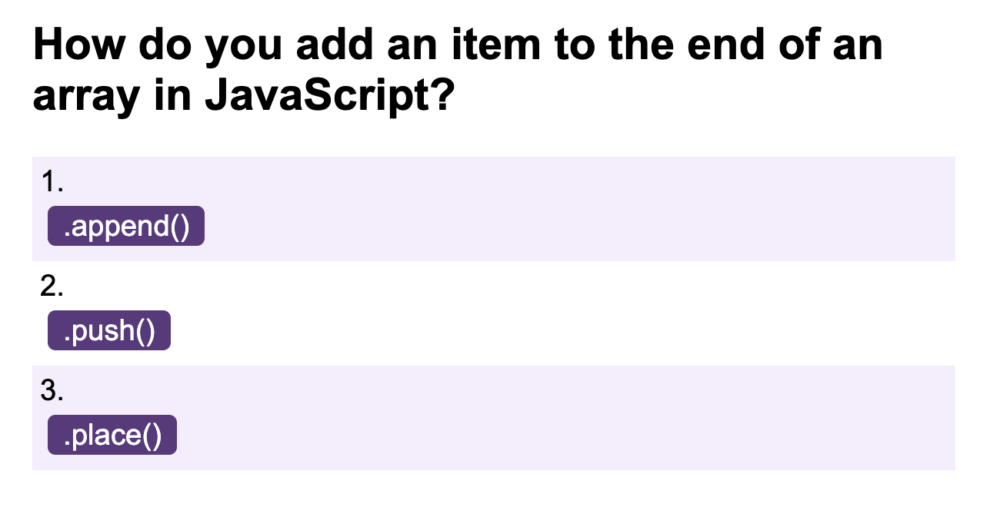
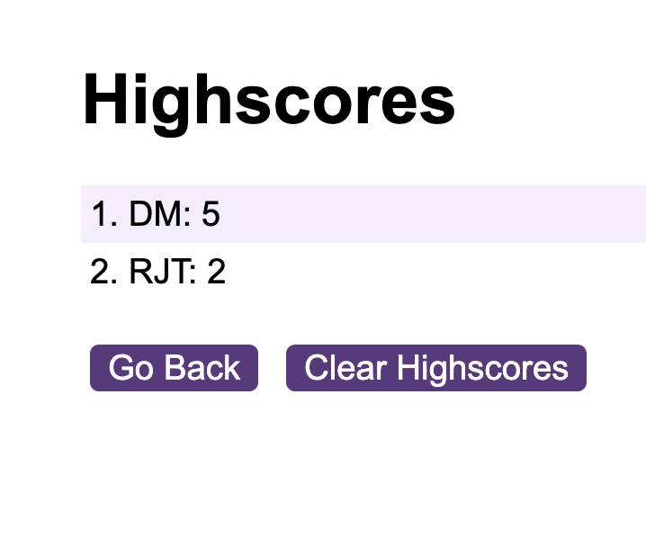

# Code-Quiz

## Description
Introducing LocalStorage and webAPIs to our sites, this week we were tasked with creating a small quiz that featured responsive HTML and CSS driven by JavaScript. When a user has finished the quiz or their time has run out, they have the option to add their score to the leader board with their initals. The leaderboard can be accessed on the highscores page.

## Local Storage
As the local storage can only store strings, I have used JSON to store the leaderboard. And array of objects is created with each object storing the users initials and their score. Using .stringify() the array is formatted in JSON and stored.

On the Highscores page JSON.parse() is used to recreate the array and display the leaderboard. 

```javascript
    var scores = JSON.parse(localStorage.getItem("scores"));
    if (scores != null) {
        for (i = 0; i < scores.length; i++) {
            renderScores(scores[i]);
        };
    }
```

## Deployed Site
The site is deployed using GitHub Pages

https://roberttaylor94.github.io/Code-Quiz/


<br>

